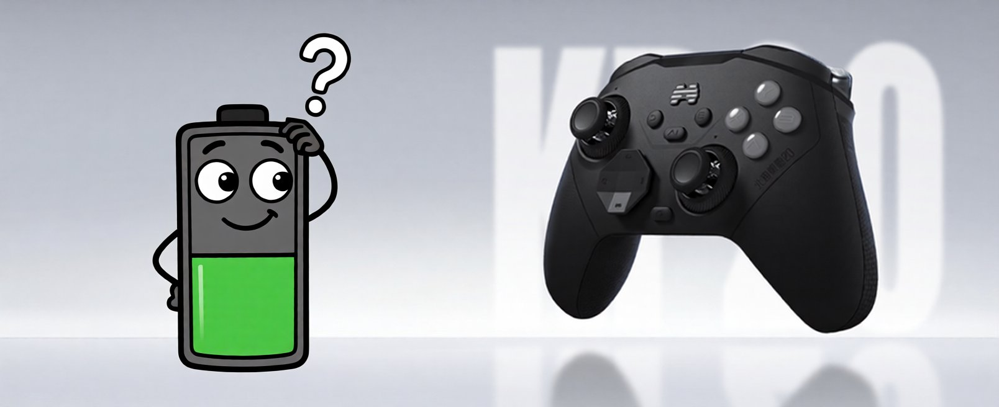
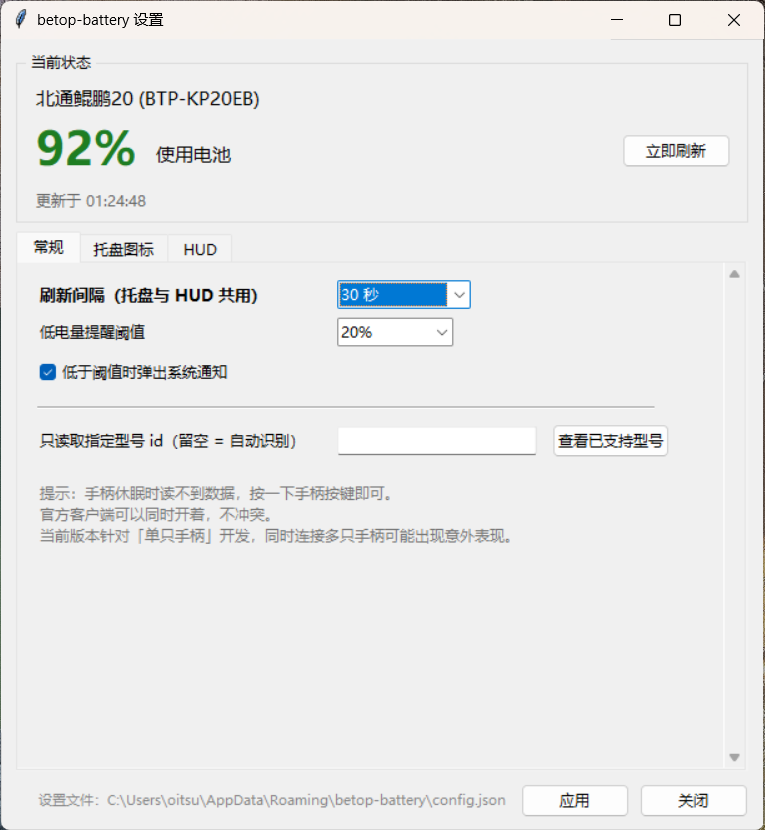
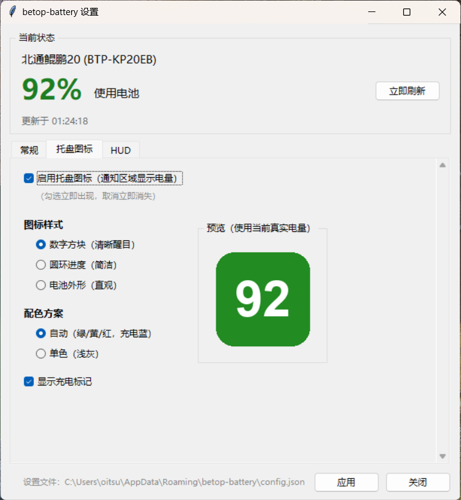
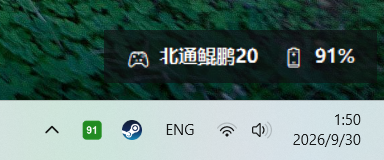
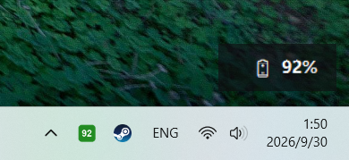

# betop-battery

**读取北通（BETOP）手柄电量的开源小工具 —— 在 Windows 通知区域显示电量百分比。**

[English](README.en.md) · 简体中文

> ### 🤖 关于本项目的开发方式
>
> 本项目由 **DeepSeek V4.1 Flash** 模型驱动
> [**DeepSeek Harness (DSH)**](https://github.com/deepseek-ai/deepseek-harness)
> 以 **vibe coding** 方式开发完成 —— 包括协议逆向分析、全部代码、单元测试与文档。
>
> 人类作者负责提出需求、真机验证与拍板；
> 具体的探索、编码、调试与文档撰写由 AI 在 DSH 中完成。
> 我们把这个过程公开，是希望它也能作为「AI 参与硬件工具开发」的一个参考样本。

---



> 手柄电量只有灯色可猜？这个工具把它变成通知区域里精确的数字。

---

## 目录

- [为什么做这个](#为什么做这个)
  - [安全性与合规性](#安全性与合规性)
- [特性](#特性)
- [快速开始](#快速开始)
  - [方式一：一键安装包 ⭐ 推荐给不熟悉命令行的用户](#方式一一键安装包-推荐给不熟悉命令行的用户)
  - [方式二：直接下载可执行文件（无需 Python）](#方式二直接下载可执行文件无需-python)
  - [方式三：从源码运行（开发者）](#方式三从源码运行开发者)
  - [命令行用法](#命令行用法)
- [工作原理与适配](#工作原理与适配)
  - [工作原理（三步）](#工作原理三步)
  - [支持的型号](#支持的型号)
  - [适配其它型号](#适配其它型号)
- [界面](#界面)
  - [图形界面](#图形界面)
  - [HUD](#hud)
- [已知限制](#已知限制)
  - [关于 Windows 的智能应用控制](#关于-windows-的智能应用控制)
- [贡献](#贡献)
- [许可](#许可)

---

## 为什么做这个

北通官方客户端（北通智控）**不显示精确电量**，只给"LED 灯颜色对应的范围"：

| 灯光颜色 | 电量范围 |
|---|---|
| 白色 | 76–100% |
| 绿色 | 51–75% |
| 黄色 | 26–50% |
| 红色 | 0–25% |

而且手柄走 **2.4G 接收器**时，Windows 的标准接口（XInput / GameInput）**拿不到电量**——
系统会认为它是"有线设备"，所有依赖标准 API 的工具（XInputBatteryMeter 等）都读不到。

**本工具直接与接收器的厂商接口通信，读出精确百分比。** 无需安装官方客户端。

### 安全性与合规性

- ✅ **不修改官方程序的任何文件**：本工具是**独立程序**，只是向接收器发送状态查询，
  既不注入官方客户端、也不改动它的任何配置或文件
- ✅ **对手柄无损坏风险**：**只读**状态（发送的查询命令就是官方客户端自己使用的那一条），
  不写配置、不刷固件、不改灯效；即使卸载也不会在手柄上留下任何东西
- ✅ **无被认定为外挂的风险**：不修改游戏进程、不读写游戏内存、不注入任何游戏，
  它只是一个"读取外设电量并显示在通知区域"的系统小工具，与游戏本身毫无交互

```
🔋 电量     : 100%
⚡ 充电状态 : 充电中
```
---

## 特性

- ✅ **精确电量百分比**（官方客户端只给范围）
- ✅ **充电状态**识别
- ✅ **托盘图标**：直接显示数字，鼠标悬停看详情（**3 种样式**可选）
- ✅ **图形设置界面**：看状态、调样式、配 HUD，带实时预览
- ✅ **悬浮叠加层（HUD）**：像帧数那样常驻显示在游戏画面上，可拖动、可鼠标穿透
- ✅ **低电量通知**：低于阈值弹系统通知（阈值/间隔可调）
- ✅ **命令行模式**：`once` / `--json`，方便脚本与自动化调用
- ✅ **数据驱动**：适配新型号只需新增一个 JSON，不用改代码
- ✅ **调试工具**：内置 `probe` 帮助你自己适配手里的其它型号
---

## 快速开始

### 方式一：一键安装包 ⭐ 推荐给不熟悉命令行的用户

到 [Releases](/releases) 下载 **`betop-battery-oneclick-v*.zip`**：

1. **解压**
2. **双击「安装.bat」**
3. 完事 —— 剩下的全自动（检测/安装 Python、装依赖、建快捷方式、启动）

```
用户操作:  解压 → 双击一次 → 完成
```

**这个方式不受 Windows「智能应用控制」限制**（它使用系统里已有签名的 Python，
而不是未签名的 exe）。所以**即使你被 exe 弹窗拦住了，这个方式也能用。**

卸载：Windows「设置 → 应用 → 已安装的应用」里找到「北通手柄电量」，
或双击安装目录（`%LOCALAPPDATA%\betop-battery`）里的「卸载.bat」。

### 方式二：直接下载可执行文件（无需 Python）

到 [Releases](/releases) 下载：

| 文件 | 说明 |
|---|---|
| `betop-battery.exe` | 托盘版（无控制台窗口）—— 双击即用 |
| `betop-battery-cli.exe` | 命令行版（有控制台输出）—— 脚本与自动化 |

> ⚠️ 未签名的 exe 会被 Windows「智能应用控制」拦截（**没有单程序白名单**）——
> 详见[后面的说明](#关于-windows的智能应用控制)。被拦住就改用方式一或方式三。

### 方式三：从源码运行（开发者）

```bash
git clone https://github.com/oitsukiii/betop-battery.git
cd betop-battery
pip install -r requirements.txt

# 免安装直接跑（推荐先试这个）
python run.py once        # 读一次
python run.py tray        # 启动托盘
# Windows 上也可以直接双击 betop-battery.bat

# 或正式安装（之后可用 betop-battery 命令）
pip install -e .
betop-battery tray
```

> Windows 上 `pip install hidapi` 会装预编译 wheel，**不需要 C 编译器**。

### 命令行用法

```bash
betop-battery                    # 读一次（默认）
betop-battery once --json        # JSON 输出（便于脚本调用）
betop-battery tray               # 托盘模式（通知区域显示电量）
betop-battery gui                # 打开图形设置界面
betop-battery overlay            # 启动 HUD
betop-battery devices            # 查看已支持的型号
betop-battery list               # 列出系统上的北通 HID 接口
betop-battery probe interfaces   # 调试：列出全部接口
betop-battery probe dump         # 调试：转储原始帧
betop-battery probe suggest      # 调试：生成新型号描述草稿
```

**使用提示**：手柄休眠时读不到数据，**按一下手柄任意按键**再试即可。官方客户端可以同时开着，不冲突。
---

## 工作原理与适配

### 工作原理（三步）

```
① 找到厂商接口          ② 发一条状态查询           ③ 从响应里取字段
   usage_page=0xFF00      02 15 (cmd=5, subcmd=1)      byte[2] = 电量 0~100
                                                       byte[4] & 0x0F = 充电中
```

实测抓到的完整帧：

```
02 15 64 00 51 01 01 00 ...
│  │  │  │  │
│  │  │  │  └─ byte[4] 低 4 位 = 1 → 充电中
│  │  │  └──── byte[3]
│  │  └─────── byte[2] = 0x64 = 100 → 电量 100%
│  └────────── header = (subcmd 0x1 << 4) | cmd 0x5 → "状态报告"
└───────────── report_id = 0x02
```

详细的帧格式、命令表、字段语义见 **[docs/protocol.md](docs/protocol.md)**。


### 支持的型号

| 型号 | 状态 | 连接方式 | 贡献者 |
|---|---|---|---|
| **北通鲲鹏20**（BTP-KP20EB）| ✅ 已验证 | 2.4G 接收器 | 初始版本 |
| 其它北通型号 | 🙋 **等待你贡献** | — | [看这里](docs/adapt-new-device.md) |

> 北通各型号的协议属于**同一家族**（同样的 `report_id + (subcmd<<4|cmd)` 帧结构），
> 所以适配新型号通常只需要改几个数字。**欢迎提 PR！**


### 适配其它型号

```bash
# 1. 让工具带你找答案
betop-battery probe interfaces    # 找到厂商接口（usage_page 0xFF00）
betop-battery probe dump          # 看原始帧，工具会标注疑似电量字节
betop-battery probe watch         # 一边充电一边看，找变化的字节
betop-battery probe suggest       # 自动生成描述文件草稿

# 2. 把草稿存成 src/betop_battery/devices/betop-<型号>.json 并按注释修改
# 3. 验证
betop-battery once
# 4. 提 PR（记得填好 tested 里的实测信息）
```

**完整的分步教程（含常见坑）**：[docs/adapt-new-device.md](docs/adapt-new-device.md)

**用 AI Agent 帮你适配**：仓库根目录带 [AGENTS.md](AGENTS.md)，
把你的手柄插上，让 agent 读它并跑 `probe`，它能自己生成描述文件并提 PR。
---

## 界面

### 图形界面

```bash
betop-battery gui
```

三个标签页：

| 标签页 | 能做什么 |
|---|---|
| **常规** | 刷新间隔（下拉预设）、低电量阈值（下拉预设）、是否弹通知、限定型号 |
| **托盘图标** | 启用开关、**3 种样式**（数字方块 / 圆环进度 / 电池外形）、配色方案、充电标记，**带真实电量的实时预览** |
| **HUD** | 开关、透明度、字号、显示内容（型号/电量/充电）、锁定布局、位置复位、背景与文字颜色 |

在托盘图标上**右键 → 设置…**（或直接**左键单击 / 双击图标**）也能打开。
改动实时写入配置文件，HUD 会自动热更新。

**常规页**：



**托盘图标页**（右侧是使用当前真实电量的预览）：



**托盘图标实际效果**（通知区域里的圆角数字）：


### HUD

```bash
betop-battery overlay
```

在屏幕角落常驻一条半透明电量条，形态类似显卡帧数叠加层：

```
北通鲲鹏20  ·  电量 95%  ·  电池
```

- **鼠标直接拖动**调整位置（位置会自动记住）
- **右键菜单**：立即刷新 / 鼠标穿透 / 显示项开关 / 复位位置 / 关闭
- **锁定布局**（Windows）：开启后鼠标事件穿过 HUD，玩游戏时不挡操作
  - ⚠️ 锁定后该窗口收不到鼠标事件，需先在设置界面取消勾选才能再拖动
- **emoji 图标**（🎮 🔋 ⚡）：可在设置界面关闭；透明度会一并作用于 emoji
- 透明度、字号、配色均可在图形界面里调；**HUD 的刷新间隔与「常规」页共用**

**HUD 实际效果**（叠加在游戏画面上；背景半透明、文字不受透明度影响）：



只想看数字、不想占地方时，可以在设置里关掉「型号」：



> HUD 与托盘是**两个独立进程**，互不影响；关掉托盘不会带走 HUD。
> 若游戏以**独占全屏**运行，HUD 可能不可见 —— 请把游戏设为「无边框窗口」。
---

## 已知限制

- ⚠️ **当前版本只针对"单只手柄"开发**：程序会在所有匹配的接口中选一个来读取。
  同时连接**多只手柄**时行为可能不符合预期（例如只显示其中一只，或读数在两支之间跳变）。
  多手柄支持尚未实现，欢迎[提 Issue](/issues)说明你的使用场景。
- **未签名 exe 可能被智能应用控制拦截**（见上一节）
- **手柄休眠时读不到**（按一下按键唤醒即可）
- **充电时电量会显示 100%**：这不是程序解析错误，而是**手柄自己上报的原始数据就是 100%**。
  实测原始帧对比：

  | 状态 | 原始帧（前 5 字节）| 电量字节 `byte[2]` |
  |---|---|---|
  | 用电池 | `02 15 5D 00 50 …` | `0x5D` = **93%** |
  | 充电中 | `02 15 64 00 51 …` | `0x64` = **100%** |

  程序按与官方客户端**完全相同的方式**读取 `byte[2]`，所以这是设备侧
  （BMS / 充电电路把测量电压抬高）的行为，软件层面无法修正。
  充电时请看**充电图标 ⚡** 来判断状态，不要以那个 100% 为准。
- 协议可能随**固件更新**变化；若失效请[提 Issue](/issues)并附上 `probe dump` 输出
- 目前验证环境：Windows 11 + 2.4G 接收器（蓝牙模式未测）
- 写入长度对某些固件敏感，描述文件里可配 `write_lengths`

### 关于 Windows 的智能应用控制

Windows 11 的 **智能应用控制（Smart App Control）** 会**阻止未签名的可执行文件**，
包括你自己刚编译出来的 exe：

```
'betop-battery.exe' 已被组织自 Device Guard 策略阻止
```

**这不是程序有问题**，而是系统策略：SAC 只放行有可信签名的程序。检查是否开启：

```powershell
Get-ItemProperty 'HKLM:\SYSTEM\CurrentControlSet\Control\CI\Policy' |
  Select-Object VerifiedAndReputablePolicyState
# 1 = 开启（强制）   0 = 关闭   2 = 评估模式
```

**建议的处理方式**：

| 情况 | 建议 |
|---|---|
| 自己用 | **用源码运行**（`python run.py tray`）—— Python 解释器有签名，不受影响 |
| 想分发 exe | 需要**代码签名**（个人开发者可购买 OV 代码签名证书）|
| 用户被拦截 | 让其改用 `pip install` 或源码运行；**不要**建议关闭 SAC（关闭不可逆，需重装系统才能恢复） |

> GitHub Release 的附件会被打上"来自互联网"标记，SAC 开启的用户同样会被拦截。

#### 让源码方式也一样方便（推荐做法）

既然源码方式不受 SAC 影响，可以给自己建个**桌面快捷方式**，效果和双击 exe 一样：

1. 生成应用图标（可选，仅需一次）：`python tools/make_icon.py`
2. 新建快捷方式，目标填：
   ```
   pythonw.exe "C:\path\to\betop-battery\run.py" tray
   ```
   起始位置填项目目录，图标选 `assets\icon.ico`
3. 用 `pythonw.exe`（不是 `python.exe`）→ **不会出现黑窗口**

也可以再建一个指向 `run.py gui` 的快捷方式用来打开设置界面。

#### Release 里各个文件有什么区别

| 文件 | 用途 | 需要 Python | 受 SAC 拦截 |
|---|---|---|---|
| `betop-battery-oneclick-v*.zip` | **一键安装包** ⭐ 最省事 | 自动安装 | ✅ 不受影响 |
| `betop-battery.exe` | 托盘版（无控制台窗口）| 不需要 | ⚠️ 会被拦 |
| `betop-battery-cli.exe` | 命令行版（有控制台）| 不需要 | ⚠️ 会被拦 |
| `Source code (zip)` | 源码 | 需要自己装 | ✅ 不受影响 |
---

## 贡献

非常欢迎！尤其是**适配你手上的其它北通型号**——你可以手搓代码，也可以把本项目链接交给你的 agent 来做（仓库里带 [AGENTS.md](AGENTS.md)，专门写给 AI agent 看）。

- [适配新型号教程](docs/adapt-new-device.md)
- [协议规格](docs/protocol.md)
- Issue / PR 中英文都欢迎
---

## 许可

[MIT](LICENSE)
